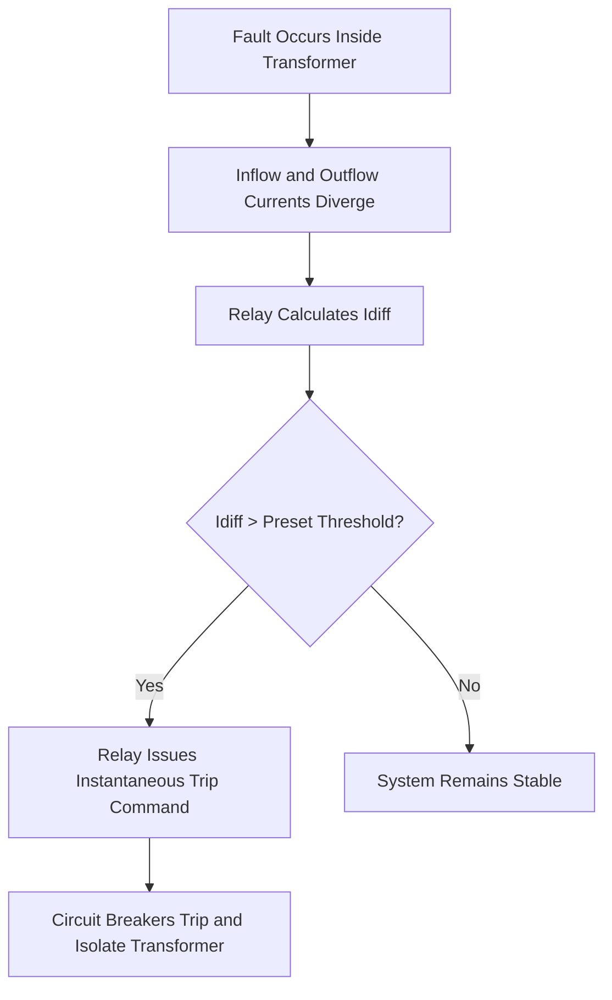

# Numerical Protection Relay and Protection Functions – Study Notes

Welcome to the comprehensive study guide on modern substation automation, numerical protection relays, communication protocols, and core protection functions.

---

## 📌 Table of Contents

1. [What is a Numerical Protection Relay?](https://www.google.com/search?q=%231-what-is-a-numerical-protection-relay)
2. [IEC 61850 Communication Protocol](https://www.google.com/search?q=%232-iec-61850-communication-protocol)
3. [GOOSE Messaging](https://www.google.com/search?q=%233-goose-messaging)
4. [MMS Communication](https://www.google.com/search?q=%234-mms-communication)
5. [Fiber Link Monitoring](https://www.google.com/search?q=%235-fiber-link-monitoring)
6. [Distance Protection (ANSI 21)](https://www.google.com/search?q=%236-distance-protection-ansi-21)
7. [Distance Protection Zones](https://www.google.com/search?q=%237-distance-protection-zones)
8. [Fault Locator Function](https://www.google.com/search?q=%238-fault-locator-function)
9. [Differential Protection (ANSI 87)](https://www.google.com/search?q=%239-differential-protection-ansi-87)
10. [Principle of Differential Protection](https://www.google.com/search?q=%2310-principle-of-differential-protection)
11. [Transformer Differential Protection](https://www.google.com/search?q=%2311-transformer-differential-protection)
12. [Differential Relay Trip Logic](https://www.google.com/search?q=%2312-differential-relay-trip-logic)
13. [What to Check on Relay Software](https://www.google.com/search?q=%2313-what-to-check-on-relay-software)
14. [Quick Exam Revision](https://www.google.com/search?q=%23-quick-exam-revision)

---

## 1. What is a Numerical Protection Relay?

A **Numerical Protection Relay** is a specialized high-speed industrial computer used in modern substations to detect electrical faults and protect power system equipment.

### ⚙️ Working Principle

1. **Signal Reception:** Receives voltage and current signals from:
* Current Transformers (CTs)
* Potential/Voltage Transformers (PTs or CVTs)


2. **Data Conversion:** Converts analog signals into digital data using an **ADC (Analog-to-Digital Converter)**.
3. **Processing:** Continuously processes the data using advanced mathematical algorithms.
4. **Fault Detection:** Detects abnormal conditions such as short circuits, earth faults, overloads, and equipment failures.
5. **Execution:** Sends a trip command to the circuit breaker within a few milliseconds.

### 🌟 Advantages

* High-speed operation
* Accurate fault detection
* Event and fault recording capability
* Self-diagnostics and internal health monitoring
* Seamless communication with SCADA systems
* Significantly reduced wiring footprint using fiber-optic communication

---

## 2. IEC 61850 Communication Protocol

### What is IEC 61850?

**IEC 61850** is the overarching international communication standard used in modern digital substations. It enables Intelligent Electronic Devices (IEDs), relays, and SCADA systems to seamlessly interoperate and communicate over fiber-optic networks.

### 🚀 Benefits

* Faster communication speeds
* Eliminates miles of traditional copper wiring
* Enhanced system reliability
* Plug-and-play style integration of multi-vendor devices
* Comprehensive remote monitoring and control

---

## 3. GOOSE Messaging

* **Full Form:** Generic Object Oriented Substation Events
* **Purpose:** Used for ultra-fast transmission of high-priority protection signals between relays and circuit breakers.

### 📋 Key Examples

* Trip commands
* Breaker failure signals
* Interlocking and blocking signals
* Transformer protection commands

### ⚡ Characteristics

* **Peer-to-Peer:** Communication happens directly between IEDs without a central controller.
* **Latency:** Extremely fast operation, typically **less than 3–4 ms**.

> ### 🔍 What to Check (Relay Software / HMI)
> 
> 
> * GOOSE communication status (Active/Inactive)
> * GOOSE message logs & transmission counters
> * Network latency and error status
> 
> 

---

## 4. MMS Communication

* **Full Form:** Manufacturing Message Specification
* **Purpose:** Used for slower, supervisory communication between substation relays and the main SCADA system.

### 📊 Data Transferred

* Current and voltage telemetry measurements
* Circuit breaker status indications
* Alarm and event records

### 🛠️ Characteristics

* **Client-Server Architecture:** Relays act as servers uploading data to the SCADA client.
* **Timing:** Slower than GOOSE, optimized for data archiving and human-machine monitoring.

---

## 5. Fiber Link Monitoring

Modern substations replace point-to-point copper wiring with a robust fiber-optic backbone network.

### 🟢 Normal Maintenance Checks

* Green communication LEDs on the physical relay
* Network health status pages
* Real-time communication diagnostic logs

### ⚠️ Communication Failure Behavior

If a fiber link fails, the relay will instantly generate a high-priority alarm. The HMI or SCADA event list will read out:

```text
[ALARM] Communication Failure
[ALARM] Fiber Link Down
[ALARM] Network Diagnostic Error

```

---

## 6. Distance Protection (ANSI 21)

Distance protection is primarily deployed for the protection of:

* Transmission lines
* Long overhead lines
* High-voltage grid interconnections (e.g., 220 kV lines entering a substation)

### 📐 Principle of Operation

A distance relay continuously calculates the line impedance using Ohm's Law:

$$Z = \frac{V}{I}$$

* Where **Z** = Impedance, **V** = Voltage, and **I** = Current.

### Why It Works

Because line impedance is directly proportional to the physical length of the line:

* **Under Normal Conditions:** Voltage is high, current is low $\rightarrow$ calculated $Z$ is high.
* **Under Fault Conditions:** Voltage drops drastically, current spikes $\rightarrow$ calculated $Z$ decreases instantly.
The relay compares the calculated $Z$ against preset reach thresholds to isolate the fault.

---

## 7. Distance Protection Zones

To maintain selectivity and avoid unnecessary tripping, the transmission line is divided into overlapping zones of protection.

| Zone | Coverage | Time Delay | Purpose |
| --- | --- | --- | --- |
| **Zone 1** | 80% of protected line | `0 ms` (Instantaneous) | Primary protection; leaves 20% margin to avoid overreaching into next busbar. |
| **Zone 2** | 100% of line + 20% of adjacent line | `300–400 ms` | Backup protection for the remaining 20% of the line and allows downstream relays to clear local faults first. |
| **Zone 3** | 100% of line + 100% of adjacent line | `800–1000 ms` | Remote backup protection for neighboring transmission lines. |

---

## 8. Fault Locator Function

Modern numerical relays feature an advanced fault locator matrix that calculates the exact geographic location of a line fault.

### 📝 Example Relay Display Outage Output:

```text
FAULT DETECTED: Phase R–Earth Fault
CALCULATED LOCATION: Fault Distance = 14.2 km

```

* **Benefits:** Speeds up line patrol maintenance, reduces overall outage time, and makes fault identification effortless.

---

## 9. Differential Protection (ANSI 87)

Differential protection provides extremely fast, localized internal fault protection. It is typically reserved for capital-intensive equipment:

* Power transformers
* Generation units
* Substation Busbars
* Shunt/Series Reactors

---

## 10. Principle of Differential Protection

Differential protection relies strictly on **Kirchhoff's Current Law (KCL)**.

### KCL Statement

> The total current entering a closed node/system must equal the total current leaving that system.

$$\sum I_{in} - \sum I_{out} = 0$$

* **Healthy System:** Incoming Current = Outgoing Current (Differential Current $I_{diff} = 0$)
* **Faulted System:** Incoming Current $\neq$ Outgoing Current (Differential Current $I_{diff} > 0$)

---

## 11. Transformer Differential Protection

Current Transformers (CTs) are strategically installed on both sides of the asset:

* **High Voltage Side** (e.g., 220 kV)
* **Low Voltage Side** (e.g., 110 kV / 33 kV)

The relay scales these current signals internally to account for the transformer turn ratio and phase shifts, then continuously calculates:

$$I_{diff} = I_{in} - I_{out}$$

### ⚖️ Operational Conditions

#### 1. Normal / External Fault Conditions

Current entering the transformer matches the current exiting it.


$$I_{diff} = 0$$

* **Relay Action:** Stable; no trip command issued.

#### 2. Internal Fault Conditions

*(e.g., Winding short circuits, insulation degradation, turn-to-turn faults, phase-to-ground faults)*
The internal balance is completely disrupted because current leaks into the fault node.


$$I_{diff} > 0$$

* **Relay Action:** Instantly trips all associated circuit breakers.

---

## 12. Differential Relay Trip Logic



---

## 13. What to Check on Relay Software

### 🌐 IEC 61850 & Comms

* GOOSE communication status flags
* MMS client connection parameters
* Fiber link health indicators & RX/TX optical power levels
* Active communication network alarms

### 📏 Distance Protection (ANSI 21)

* Zone 1, Zone 2, and Zone 3 reach settings ($\Omega$)
* Programmed time delay coordinators
* Fault locator fault logs and history

### 🔄 Differential Protection (ANSI 87)

* Programmed CT ratios and matching factors
* Real-time HV and LV current scaling values
* Measured differential current ($I_{diff}$) and bias current ($I_{restraint}$)
* Pickup threshold settings and tripping history logs

---

## ⚡ Quick Exam Revision

* **Numerical Relay:** A microprocessor-based protection device that converts analog $V/I$ signals into digital data and runs mathematical algorithms to clear grid faults.
* **IEC 61850:** The international standard for digital substation communications.
* **GOOSE:** Peer-to-peer messaging optimized for ultra-fast protection actions ($< 4\text{ ms}$).
* **MMS:** Client-server messaging optimized for slower SCADA data monitoring.
* **Distance Protection (ANSI 21):** Calculates impedance via $Z = \frac{V}{I}$ to locate and isolate transmission line faults.
* **Zones:** * Zone 1: $80\%$, $0\text{ ms}$
* Zone 2: $120\%$, $300\text{-}400\text{ ms}$
* Zone 3: Remote Backup, $800\text{-}1000\text{ ms}$


* **Differential Protection (ANSI 87):** Based on KCL. Healthy condition: $I_{in} = I_{out}$. Internal fault condition: $I_{diff} > 0$.
* **Primary Objective:** Fast fault isolation to minimize equipment damage and maintain power grid stability.
